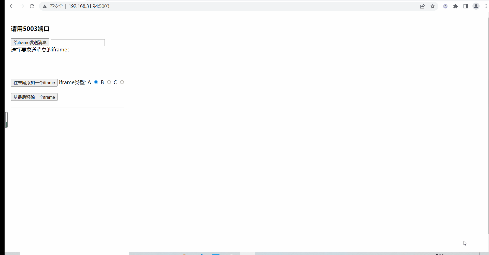

# cross-domain-emitter

跨载体的事件总线，用法类似于 node eventEmitter，但是进行了扩展使其变成一个可扩展不同类型的消息发送者和消息订阅者的一个发布订阅者模式。

## feature

- `同一window上下文事件分发`

- `同域跨Tab事件分发`:通过BroadcastChannel API实现同域不同Tab之间的实时通信，不支持时自动回退到localStorage。

- `跨iframe事件分发`:

  - `支持不同域名或相同域名多个iframe进行事件分发`

  - `支持单发，多发、广播事件`

  - `接入主文档的应用可以在以iframe形式接入和以直接挂载dom方式接入之间进行无缝切换。与主文档通信的相关事件分发代码不变。`

## 架构设计

项目采用模块化设计，每个通信方式都有独立的模块：

- **`localStorage`**: 基于localStorage的同域跨窗口通信
- **`messageChannel`**: 基于BroadcastChannel API的同域Tab间通信（仅支持BroadcastChannel的浏览器）
- **`sameOrigin`**: 整合localStorage和BroadcastChannel的同域通信模块，自动选择最佳通信方式

## usage

` pnpm add cross-domain-emitter -S`

or

`npm i cross-domain-emitter -S`

### 同域跨Tab通信（推荐）

使用 `sameOrigin` 模块，它会自动选择最佳的通信方式：

```typescript
import { SameOriginEventBus, createSameOriginEventBus } from "cross-domain-emitter";

// 创建SameOriginEventBus实例，优先使用BroadcastChannel
const sameOriginEventBus = createSameOriginEventBus({
  preferBroadcastChannel: true
});

// 监听消息
sameOriginEventBus.on("message", (data) => {
  console.log("收到来自其他Tab的消息:", data);
});

// 发送消息到其他Tab
sameOriginEventBus.sendToOtherTabs("message", "Hello from Tab A");

// 发送消息到所有Tab（包括当前Tab）
sameOriginEventBus.sendToAllTabs("notification", "Important message");

// 监听Tab连接/断开事件
sameOriginEventBus.onTabConnected((tabId) => {
  console.log(`Tab ${tabId} 已连接`);
});

sameOriginEventBus.onTabDisconnected((tabId) => {
  console.log(`Tab ${tabId} 已断开`);
});

// 检查当前使用的通信方式
console.log(`当前通信方式: ${sameOriginEventBus.getCurrentTransceiverType()}`);

// 手动切换通信方式
if (sameOriginEventBus.isBroadcastChannelSupported()) {
  sameOriginEventBus.switchToBroadcastChannel();
} else {
  sameOriginEventBus.switchToLocalStorage();
}
```

### 仅使用BroadcastChannel（高级用法）

如果你只需要BroadcastChannel功能：

```typescript
import { BroadcastChannelTransceiver, createBroadcastChannelTransceiver } from "cross-domain-emitter";

const broadcastChannelTransceiver = createBroadcastChannelTransceiver({
  win: window,
  channelName: 'my-channel'
});

// 直接使用BroadcastChannel进行通信
broadcastChannelTransceiver.send('event', 'data');
```

### 仅使用localStorage

如果你只需要localStorage功能：

```typescript
import { LocalStorageTransceiver, createLocalStorageTransceiver } from "cross-domain-emitter";

const localStorageTransceiver = createLocalStorageTransceiver({
  win: window,
  keyPrefix: 'my-app-'
});
```

### 跨iframe通信

```
// main document  http://main.com
import { WindowServer } from "cross-domain-emitter";

const server = new WindowServer("uuid");
server.on("message",(data)=>{
    ...
})
const transceiver = server.addIframeTransceiver({
    iframe: iframe,
    host: 'http://iframe.com',//或者*
    url: 'pageUrl',
});

iframe.onload=()=>{
    transceiver.start();
}

```

```
// iframe document http://iframe.com
import { WindowClient } from "cross-domain-emitter";

const client = new WindowClient("uuid");

const transceiver = client.createIframeTransceiver(`http://main.com||"*"`);
transceiver.start();
transceiver.onConnected((error) => {
    if (error) {
        console.log(error);
        return;
    }
    client.emit("message",window.location.href+": 我连接上啦。",{
        local: false
    })
});

```

## API

### SameOriginEventBus

整合localStorage和BroadcastChannel的同域通信事件总线类。

#### 构造函数选项

- `channelName`: 通信频道名称，默认为 'cross-domain-emitter-same-origin'
- `keyPrefix`: localStorage键前缀，默认为 'same-origin-'
- `filter`: 消息过滤器函数
- `preferBroadcastChannel`: 是否优先使用BroadcastChannel，默认为true

#### 主要方法

- `sendToOtherTabs(eventName, data, option)`: 发送消息到其他Tab
- `sendToAllTabs(eventName, data, option)`: 发送消息到所有Tab
- `onTabConnected(callback)`: 监听Tab连接事件
- `onTabDisconnected(callback)`: 监听Tab断开事件
- `getCurrentTransceiverType()`: 获取当前使用的通信方式
- `switchToBroadcastChannel()`: 切换到BroadcastChannel
- `switchToLocalStorage()`: 切换到localStorage
- `isBroadcastChannelSupported()`: 检查BroadcastChannel支持
- `getConnectedTabCount()`: 获取连接Tab数量
- `checkStatus()`: 检查通信状态
- `stop()`: 停止通信
- `restart()`: 重新启动通信
- `refreshConnection()`: 强制刷新连接

### BroadcastChannelTransceiver

专门用于BroadcastChannel API的收发器类。

#### 主要方法

- `isBroadcastChannelSupported()`: 检查BroadcastChannel支持
- `getConnectedTabCount()`: 获取连接Tab数量

## examples


 
 demo code in tests.

### 同域通信演示

在 `examples/same-origin-communication-example.ts` 中提供了完整的使用示例，包括：

1. **基本通信**: 创建和配置SameOriginEventBus
2. **强制localStorage**: 强制使用localStorage进行通信
3. **动态切换**: 运行时切换通信方式
4. **消息过滤**: 自定义消息过滤器
5. **多频道通信**: 创建多个独立通信频道
6. **错误处理**: 连接状态监控和自动重连
7. **实际应用**: 购物车同步等实际场景

### 测试

运行测试来验证功能：

```bash
npm test
```

## 浏览器兼容性

- **BroadcastChannel**: Chrome 54+, Firefox 38+, Safari 15.4+
- **localStorage**: 所有现代浏览器
- **自动降级**: 不支持的浏览器自动使用localStorage方案
